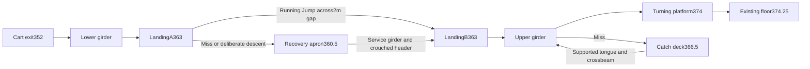

# First-taper inspection connection — 352 to 374.25 m

## Implemented encounter

The cart's existing supported352 m Tower exit approaches a frame inspection route, not another powered lift. Native static Kit1932 contains27 parts;1933 contains13 recovery/support parts, seated on the existing352 m ring. `src/sim/parkour_route.cpp` owns authored geometry; native contact/foot actuation remains in `simulation.cpp`. Godot renders those same native parts. No bespoke controller, checkpoint, motion grant or physics authority was added.

The lower0.46 m girder rises11 m from(-24,352,-139.5) to(-24,363,-163). At363 m the two distinct landings leave an actual2 m gap. The direct route requires a supported running Jump. A missed gap falls2.5 m onto the actual360.5 m apron. That apron permits a slower service-girder alternative: a bearing header blocks standing passage, but the ordinary crouched body can pass before standing again and rejoining the second landing. The upper girder rises to374 m, with a366.5 m catch deck and supported return tongue below. The final return steps0.25 m onto the existing WorldSolid51 floor374.25 and continues along it.

The exposed line and shorter jump trade commitment against the lower, sheltered service passage. Misses cost height and require actual repositioning/crouching/re-ascent; they do not restore the player automatically. Native posts, crossheads and bearings make the fixed reactions visible. Inspection steel, rusted supports and galvanised tread use three shared materials and one128px mipmapped normal texture (~85KiB). Tread detail adds no relief geometry. Two small flush caged lamp faces sit within real existing post faces; their7m warm nonshadow light pools fade with distance, adding no support or motion. Weathered coatedsteel supplies diffuse response in observed Tower shadows. Phone appearance and performance are not established. Wider inhabited-world detail and persistent movable-machine consequences remain separate unfinished goal requirements.

## Cause-driven geometry repair

The first actual native traversal was displaced west off the lower girder nearZ=-149.6. A catch-deck post atX=-23.6 intruded0.13 m into the loaded capsule's east envelope. The independent source finding matched the actual trace betweenZ=-148.239 and-152.029. Moving the post centre to-23.2 leaves0.27 m nominal clearance while retaining its352 m footing and full crosshead connection. No movement, collision mask or acceptance was relaxed.

## Evidence boundary

The actual normal-world primary test reaches stable374.25 m existing footing and walks3.5 m onward using ordinary inputs, full gravity and no hands/vault/chute/deaths. Its sole initial staging point is the previously measured cart Tower exit, not an invented test spawn; it does not establish an uninterrupted grade-to374 campaign.

Native middle-miss/service and upper-miss/tongue campaigns pass ordinary re-ascent onto the existing374.25 floor and continued walking, with no deaths. Actual rendered native/mesh/material parity passes48,857 checks across214 Kit bodies. The final actual viewport-touch campaign passes landingA, the2m Jump, real middlecatch, standingrefusal/crouchedservicepassage and ordinary upperexit/onward3.517m with support51/fullgravity/zerodeaths. Earlier automation failures were corrected through bounded ordinary stick effort and antiwindup, without changing physics, clearance or accepted footing. Uppermiss remains native-only. Final exact-source Android delivery is pending. A force/controller balance flag is not evidence of completed XCoM instability or human phone usability. Device feel, danger/readability, texture quality and sustained performance remain unobserved.
